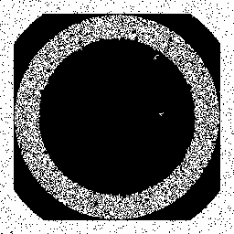
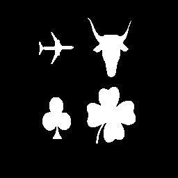

# Connected-component-labelling and Set Operations
Project-2 as part of EE455 - Digital Image Processing 1. This project considers the application of a sequence of simple image-processing operations to an image, such as connected-component labeling and logical (set) operations.. The tasks that were to be done are included in the file p2.pdf. This project required us to submit the files in MATLAB by performing Image processing methods without the use of inbuilt MATLAB function for DIP. Please find the report ReportProject2_PavanGurudath.pdf that contains the entire report for this project.

## Bright region extraction

The task was to seperate four largest components to the best possibility of the noisy image. The ouptut image is as follows: 

## Loogical(Set) Operation
Logical operations of AND, OR, XOR and NOT of images A  and B  are performed. 
The minimum of images C and D is also performed on  and 
